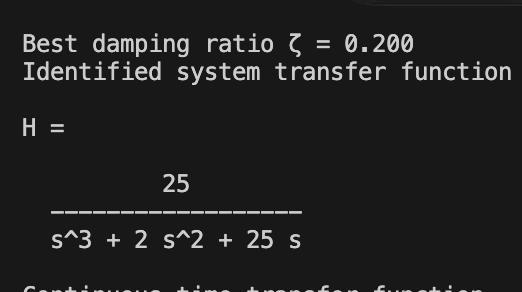
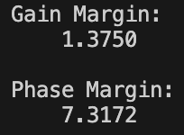
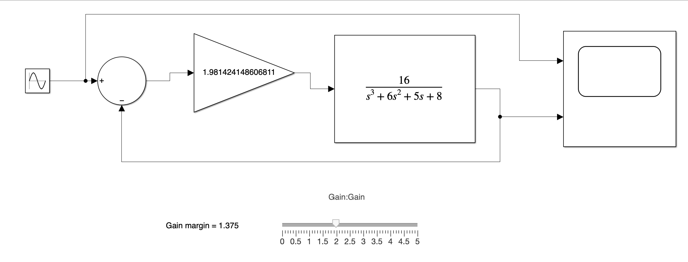
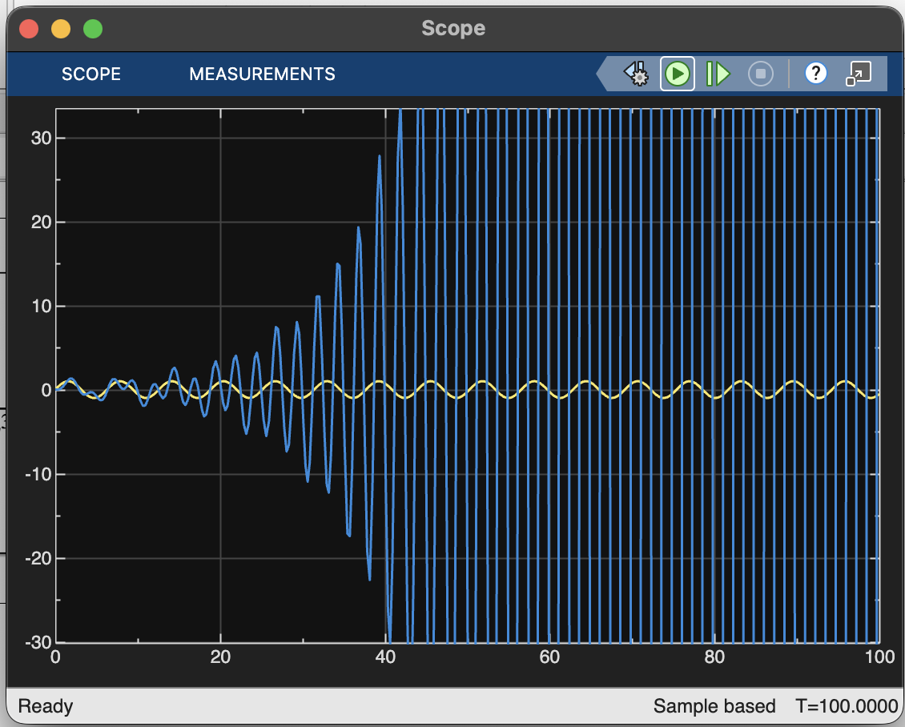
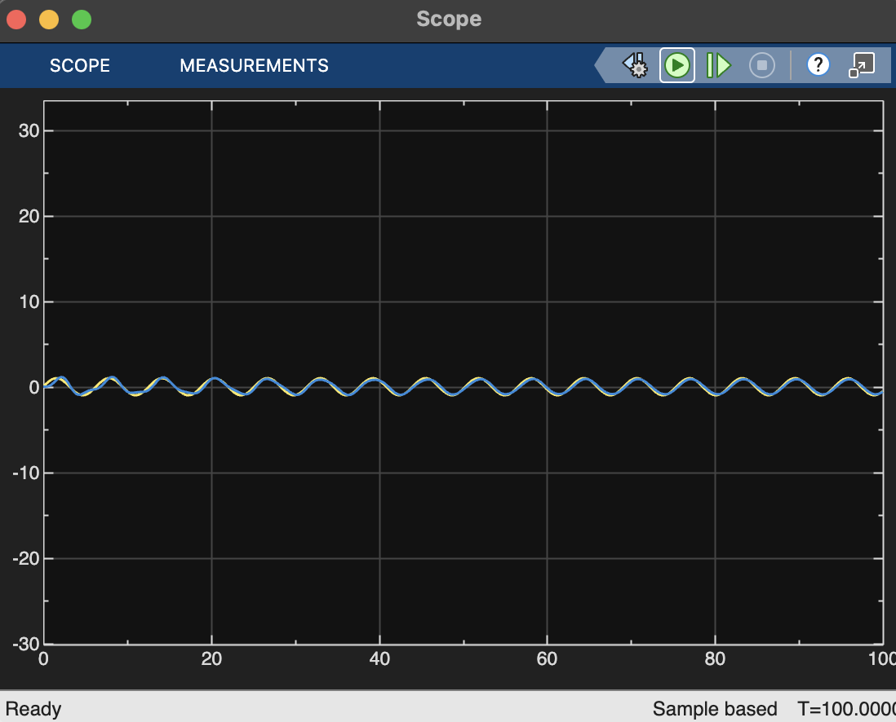

# Tutorial 2

### Anish Rayaguru ME22B105 Control systems

##### Question 1
From the first part of my script we find that for bode_q1.fig the transfer function is- 

which is a super imposition of  $\frac{1}{s}$ and $\frac{\omega_n^2}{\omega_n^2 + s^2 + 2\zeta\omega s}$

Where $\omega_n = 5$ (from Bode plot)

We use the MATLAB script to find the zeta value for which it best fits the black-box bode plot

---

##### Question 2

for gain = 1.98- 

for gain- 1.162

The variation can be observed by altering the slider in simulink

Simulink and MATLAB scripts are included in the zip file.

Proof that introducing phase offset equal to phase margin leads to instability(PTO) -

